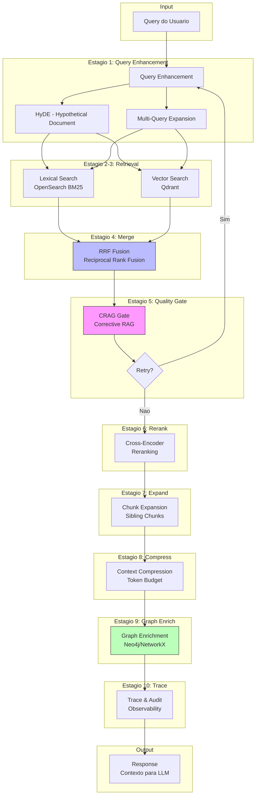

# Arquitetura do RAG Pipeline - Iudex

## Visao Geral

O sistema RAG (Retrieval-Augmented Generation) do Iudex implementa um pipeline de 10 estagios projetado especificamente para o dominio juridico brasileiro. O pipeline combina busca lexical (BM25) com busca vetorial semantica, aplicando tecnicas avancadas como CRAG (Corrective RAG), reranking neural e enriquecimento via grafo de conhecimento.

## Diagrama do Pipeline



## Descricao dos Estagios

### Estagio 1: Query Enhancement (Aprimoramento de Query)

**Componente:** `QueryExpansionService`

O primeiro estagio transforma a query original para melhorar o recall da busca:

- **HyDE (Hypothetical Document Embedding):** Gera um documento hipotetico que responderia a query, usa seu embedding para busca. Util para queries abstratas ou conceituais.

- **Multi-Query Expansion:** Gera variacoes da query original para capturar diferentes aspectos semanticos.

**Otimizacao:** Queries com padroes de citacao (Art., Lei, Sumula) pulam este estagio pois busca exata eh mais eficiente.

### Estagio 2: Lexical Search (Busca Lexical)

**Componente:** `OpenSearchService`

Busca baseada em BM25 no OpenSearch, otimizada para:

- Citacoes exatas (artigos de lei, numeros de processo)
- Termos tecnicos juridicos
- Correspondencia de palavras-chave

**Indices disponiveis:**
- `rag-lei`: Legislacao (leis, decretos, resolucoes)
- `rag-juris`: Jurisprudencia (acordaos, decisoes)
- `rag-pecas_modelo`: Pecas processuais modelo
- `rag-sei`: Documentos internos
- `rag-local`: Documentos do caso (por tenant/case)

### Estagio 3: Vector Search (Busca Vetorial)

**Componente:** `QdrantService`

Busca semantica usando embeddings densos:

- **Modelo:** `text-embedding-3-large` (3072 dimensoes)
- **Metrica:** Similaridade de cosseno
- **Otimizacao:** Pode ser pulada se busca lexical retornar resultados de alta qualidade (Lexical-First Gating)

**Collections:**
- `lei`, `juris`, `pecas_modelo`, `sei`, `local_chunks`

### Estagio 4: Merge (Fusao RRF)

**Algoritmo:** Reciprocal Rank Fusion

Combina resultados de ambas as buscas usando a formula:

```
RRF_score = sum(1 / (k + rank))
```

Onde `k=60` (parametro padrao) e `rank` eh a posicao em cada lista.

**Beneficios:**
- Equilibra precision (lexical) e recall (vetorial)
- Robusto a diferencas de escala de scores
- Documentos bem ranqueados em ambas as buscas sobem

### Estagio 5: CRAG Gate (Controle de Qualidade)

**Componente:** `CRAGGate`

Avalia a qualidade dos documentos recuperados:

1. **Avaliacao:** Calcula score de relevancia para cada documento
2. **Decisao:**
   - `ACCEPT`: Documentos sao relevantes, continuar
   - `RETRY`: Qualidade baixa, tentar nova busca com query expandida
   - `REJECT`: Documentos irrelevantes, pode indicar ao usuario

**Thresholds:**
- `crag_min_best_score`: 0.5 (melhor documento deve ter score >= 0.5)
- `crag_min_avg_score`: 0.35 (media dos top-N deve ser >= 0.35)
- `crag_max_retries`: 2 (maximo de tentativas)

### Estagio 6: Rerank (Reordenacao)

**Componente:** `CrossEncoderReranker`

Cross-encoder neural para reordenacao de precisao:

- **Modelo principal:** `cross-encoder/ms-marco-multilingual-MiniLM-L6-H384-v1`
- **Fallback:** `cross-encoder/ms-marco-MiniLM-L-6-v2`

**Caracteristicas:**
- Processamento em batch para eficiencia
- Suporte a FP16 para GPU
- Cache do modelo para reduzir latencia

### Estagio 7: Expand (Expansao de Chunks)

**Componente:** `ChunkExpander`

Recupera chunks adjacentes (siblings) para restaurar contexto:

- **Window:** 1 chunk antes e depois
- **Max extra:** 12 chunks adicionais
- **Merge adjacent:** Une chunks consecutivos

**Proposito:** Chunks pequenos sao bons para busca mas podem perder contexto. A expansao recupera o contexto sem prejudicar a precisao da busca.

### Estagio 8: Compress (Compressao)

**Componente:** `ContextCompressor`

Reduz o contexto para caber no budget de tokens do LLM:

- **Budget padrao:** 4000 tokens
- **Tecnicas:**
  - Extracao de keywords
  - Sumarizacao seletiva
  - Truncamento inteligente

**Preserva:** Citacoes legais, numeros de artigos, nomes de partes.

### Estagio 9: Graph Enrich (Enriquecimento por Grafo)

**Componentes:** `LegalKnowledgeGraph`, `Neo4jMVPService`

Adiciona contexto estruturado do grafo de conhecimento juridico:

- **Entidades:** Leis, artigos, tribunais, sumulas
- **Relacoes:** `CITA`, `REVOGA`, `REGULAMENTA`, `INTERPRETA`
- **Hops:** 2 niveis de relacionamento

**Output:** Summary textual com artigos e precedentes relacionados.

### Estagio 10: Trace (Rastreamento)

**Componente:** `PipelineTrace`

Registra metricas e decisoes de cada estagio para:

- **Observabilidade:** Tempo de execucao por estagio
- **Debug:** Decisoes de gating e retry
- **Auditoria:** Trail completo para compliance

**Exportacao:**
- JSONL local
- OpenTelemetry (opcional)
- LangSmith (opcional)

## Modelo de Seguranca Multi-Tenant

O RAG implementa isolamento de dados por tenant e caso:

### Hierarquia de Acesso

```
Tenant (Escritorio/Empresa)
  └── Groups (Equipes/Departamentos)
       └── Users (Advogados/Analistas)
            └── Cases (Processos/Materias)
```

### Filtros Aplicados

1. **Documentos Globais:** Acessiveis por todos (legislacao, jurisprudencia publica)

2. **Documentos Locais:** Filtrados por:
   - `tenant_id`: Obrigatorio
   - `case_id`: Opcional, restringe ao caso especifico
   - `group_ids`: Opcional, permite acesso entre equipes
   - `user_id`: Opcional, documentos pessoais

### Implementacao

```python
# Exemplo de filtro aplicado na busca
filters = {
    "bool": {
        "must": [
            {"term": {"tenant_id": tenant_id}},
            {"term": {"case_id": case_id}},
        ],
        "should": [
            {"terms": {"group_ids": user_group_ids}},
            {"term": {"user_id": user_id}},
            {"term": {"scope": "global"}},
        ],
        "minimum_should_match": 1
    }
}
```

## Feature Flags

O pipeline suporta ativacao/desativacao granular de componentes:

| Flag | Padrao | Descricao |
|------|--------|-----------|
| `enable_crag` | `true` | CRAG quality gate |
| `enable_hyde` | `true` | HyDE query expansion |
| `enable_multiquery` | `true` | Multi-query expansion |
| `enable_rerank` | `true` | Cross-encoder reranking |
| `enable_compression` | `true` | Context compression |
| `enable_graph_enrich` | `true` | Knowledge graph enrichment |
| `enable_tracing` | `true` | Pipeline tracing |
| `enable_chunk_expansion` | `true` | Sibling chunk retrieval |
| `enable_lexical_first_gating` | `true` | Skip vector if lexical strong |

### Controle via Request

```json
{
  "query": "Art. 5 da CF",
  "tenant_id": "tenant-123",
  "use_hyde": false,
  "use_rerank": true,
  "force_vector": false
}
```

## Otimizacoes de Performance

### Lexical-First Gating

Para queries com padroes de citacao, o pipeline pode pular a busca vetorial:

1. Detecta padroes: `art.`, `lei`, `sumula`, numero CNJ
2. Executa apenas busca lexical
3. Se score >= 0.7 e >= 3 resultados, pula vetorial
4. Reduz latencia em ~40% para queries de citacao

### Parallel Search

Quando lexical-first nao se aplica:

1. Executa busca lexical e vetorial em paralelo
2. Aguarda ambas completarem
3. Faz merge com RRF

### Caching

- **Embeddings:** Cache de 1 hora para queries repetidas
- **Reranker:** Modelo mantido em memoria
- **Results:** Cache de 30 segundos para queries identicas

## Arquivos Principais

```
apps/api/app/services/rag/
├── config.py                    # RAGConfig - todas as configuracoes
├── pipeline/
│   ├── rag_pipeline.py          # RAGPipeline - orquestrador principal
│   └── orchestrator.py          # Orchestrator - integracao LLM
├── core/
│   ├── query_expansion.py       # HyDE e multi-query
│   ├── crag_gate.py             # CRAG quality gate
│   ├── reranker.py              # Cross-encoder
│   ├── context_compressor.py    # Compressao de contexto
│   ├── chunk_expander.py        # Expansao de chunks
│   ├── graph_rag.py             # NetworkX knowledge graph
│   └── neo4j_mvp.py             # Neo4j integration
├── storage/
│   ├── opensearch_service.py    # OpenSearch client
│   └── qdrant_service.py        # Qdrant client
└── utils/
    ├── trace.py                 # Tracing utilities
    ├── ttl_cleanup.py           # Local doc cleanup
    └── ingest.py                # Document ingestion
```

## Referencias

- [RAG Original Paper (Meta AI, 2020)](https://arxiv.org/abs/2005.11401)
- [CRAG Paper](https://arxiv.org/abs/2401.15884)
- [HyDE Paper](https://arxiv.org/abs/2212.10496)
- [RRF Paper](https://plg.uwaterloo.ca/~gvcormac/cormacksigir09-rrf.pdf)
